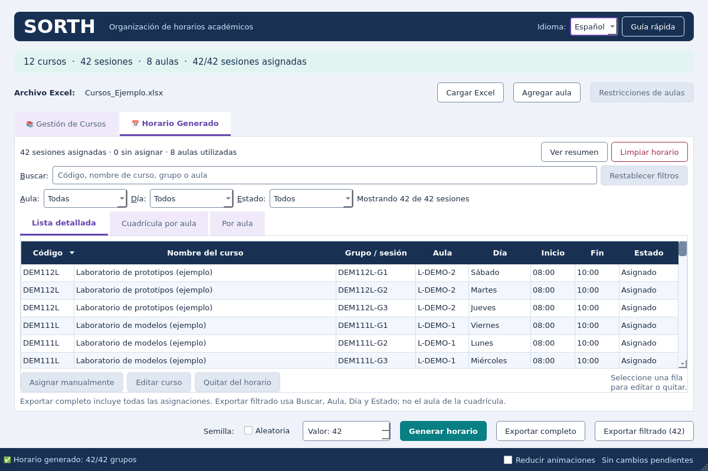
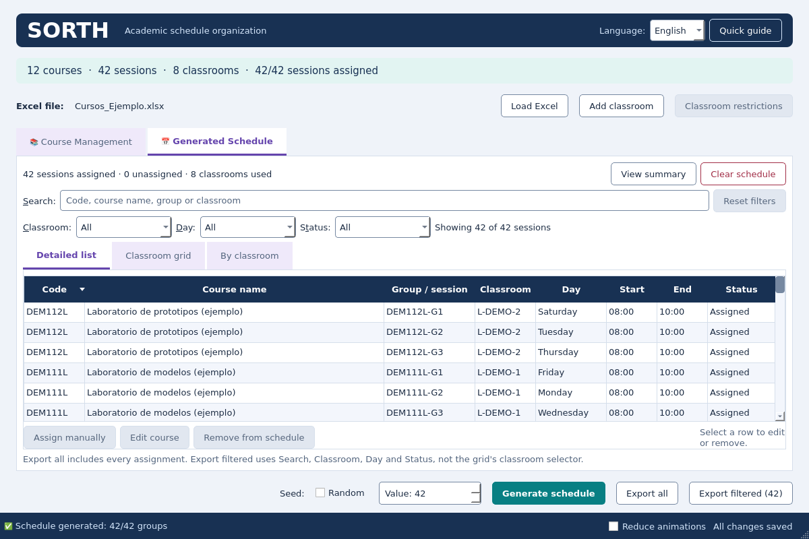
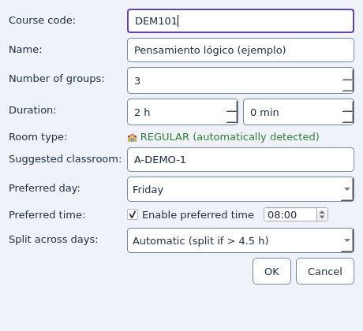

# Runtime localization

Spanish remains the default; English is the first additional locale.

## Architecture and extension contract

- `src/gui/locales/es.py` and `en.py` contain independent `MESSAGES` and `QT_MESSAGES` dictionaries. Views do not contain language-specific branches.
- `src/gui/locales/__init__.py` owns the `Language` registry: stable code, native name, Qt regional locale, catalogs, plural-rule callback and text direction. The visible selector is generated from this registry.
- Existing message IDs use the Spanish source wording, like gettext. Treat these IDs as immutable keys: changing Spanish copy means editing the Spanish catalog value, not renaming the ID across views. New repeated counts have semantic keys such as `course_count` and `result_count`.
- `msg(key, **parameters)` retains the key and arguments in a Qt-compatible `Message`. `plural(key, count, **parameters)` selects the active language's plural category each time it renders. Count catalogs support `zero`, `one`, `two`, `few`, `many`, `other`; always provide `other`. Each language chooses its own rule; the runtime does not assume every language has two forms.
- Qt adapters in `i18n_widgets.py` remember only explicitly marked messages. Ordinary strings, including user data identical to catalog keys, are literal. Live relabeling blocks incidental Qt signals, retains widgets and table items, and never reruns scheduling or reloads the session.
- QSettings stores `interface/language` under organization/application `SORTH/SORTH`, separately from SQLite. Unsupported values fall back to Spanish. Missing keys, missing plural forms and invalid placeholder translations fall back to the Spanish catalog; unknown keys display their source ID.
- Regional numbers use `LocalizedNumber`; date/time presentation helpers use the registered `QLocale`. Each owned widget gets that locale directly. The OS locale and `QLocale` global default are never changed. Domain IDs and explicit HH:mm schedule times are not localized.
- Catalogs are Python modules imported explicitly by the registry, so PyInstaller discovers them without extra runtime dependencies or a translation compiler. Qt-owned standard button/context-menu translations have their own catalog. Native system file dialogs retain platform language.
- Standard Qt translators are created only after the application exists and are owned by that application until shutdown. Their manager reference is weak; a retired manager stops supplying translations. This prevents Python garbage collection from destroying a translator while Qt holds its translation lock. Registered-widget cleanup callbacks also keep only weak manager references. No garbage-collection setting or bilingual native label is disabled.

## Adding a language

1. Copy `locales/en.py` to a new module. Preserve every message ID and interpolation field; translate values, standard Qt labels and every applicable plural category. Do not translate imported names or required workbook fields.
2. Import the module in `locales/__init__.py`, then register a `Language` with a stable code, native display name, regional Qt locale and plural callback. Static imports ensure the frozen build includes the module. An application extension can call `register_language` before constructing the UI.
3. Add catalog-key/placeholder parity checks against Spanish, plural tests for that language's boundary values, and a restart/switching test. No view changes are needed. The existing third-locale test registers a synthetic locale with zero/one/few/other forms to exercise this contract.
4. Review every screen and dialog at 1200×800 and 960×640, long names, keyboard focus and open combo boxes. RTL metadata is supported, but right-to-left layout and script-specific typography are not certified by the ES/EN tests and require a dedicated review before shipping.
5. Run the full suite and the Windows review build. The packaged smoke switches ES→EN and checks retained assignments and translated controls, producing both screenshots.

## Compatibility

The selector changes presentation only. Import sheets remain exactly `Aulas` and `Cursos`. CSV/Excel keep seven detail columns in the existing order, legacy-compatible group IDs, Spanish day names, HH:mm times, sheet names, sanitization and UTF-8 BOM/comma CSV. Full export and Ctrl+S still include every assignment; filtered export uses shared Search/Classroom/Day/Status only. A localized export format would be a separate explicit feature.

## Verification

The focused suite checks catalog coverage and placeholders; missing/invalid translations; persisted preference in fresh Python processes; ES→EN→ES with retained schedule, filters, selection and SQLite data; unsaved course/classroom/restriction dialogs; canonical stored days; literal Unicode names; busy, zero-result, cancel and stale states; bilingual full/filtered CSV and Excel; Qt standard buttons; deleted widget safety; third-language registration and plural/regional behavior.

Development previews are Linux Qt offscreen renders, not native Windows visual approval. Third-party exception details and native OS file picker chrome may retain their original language. Native Windows appearance and scaling remain release checks even when the automated Windows package smoke passes.

## Development screenshots

Spanish and English views use the same sample data and palette. These are Qt offscreen previews; they do not establish native Windows appearance.

